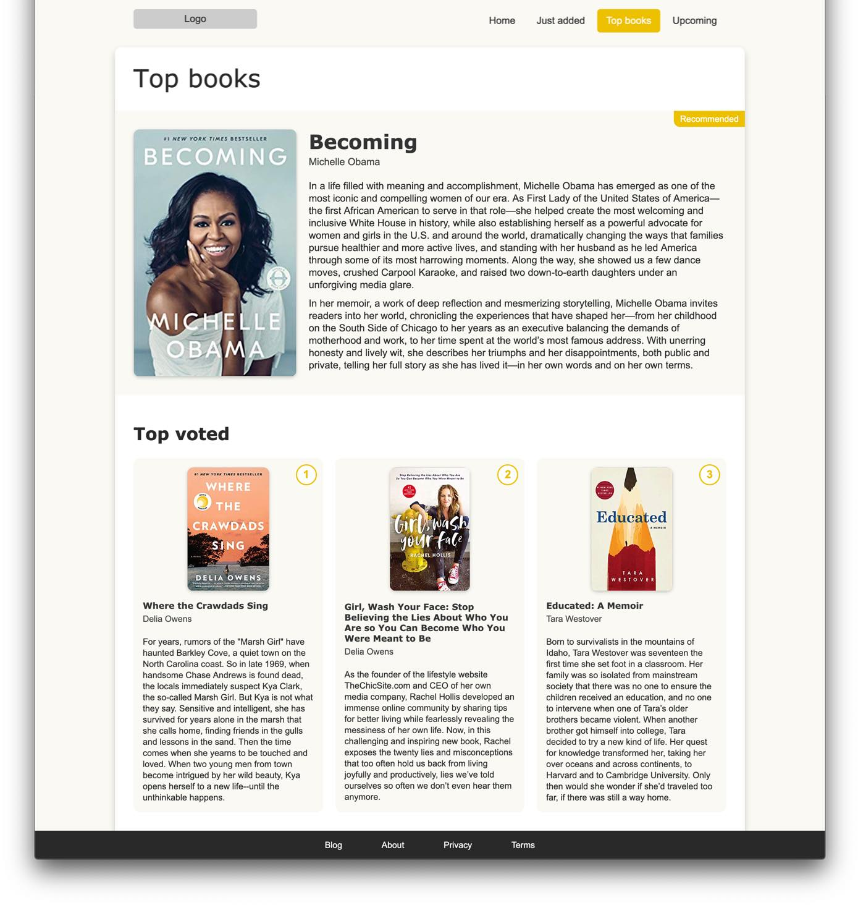

# Front end Engineer Challenge

You can submit all the answers to this assignment in a single repository (or as a zipped folder), containing markdown and code.

## 1. About you

Tell us about one of your commercial projects with Vue.js or AngularJS.

````
The project is called Symsala. It's dedicated to provide / search different services, such as
guitar lessons, pet walking, babysitting, etc. The project is supposed to help people
especially from countries with high unemployment.
Core stack is Vue / Vuex. Styling - vuetify. For the moment there is no SSR, but NUXT
is planned for the future.
````

## 2. General

##### 2.1. What kind of front end projects do you enjoy working on? Why?
````
PWA / SPA. I like to plan architecture, what kind of reusable components I need to
create, that I could use them in future.
Eye catching designs with animation.
````

##### 2.2. Which are your favorite features of HTML5? How have you used them before?
````
One of the last interesting features is picture tag, solves some responsive issues.
````

##### 2.3. Explain the difference between creating a DOM element setting `innerHTML` and using `createElement`.
````
In case of innerHTML, replaced DOM elements loose attached events, also all
references to these elements will be lost. 
Regarding performance - almost no difference.
Regarding security - XSS vulnerability
````

##### 2.4. Compare two-way data binding vs one-way data flow.
````
In case of 2-way binding - there are 2 watchers: one listens changes from UI, another
one from code. Example: Vue, Angular

In case of 1-way binding - 1 watcher, where UI is the single source of truth. Example:
React
````

##### 2.5. Why is asynchronous programming important in JavaScript?
````
Realtime projects is one of the best examples, where asynchronous programming can be
used. Non-blocking IO allows to write async code.
````

## 3. Styling

Given the HTML file **front-end/q3/q3.html**, implement the styling so the page matches the image below.



#### Bonus
- Implement styling rules that consider different screen sizes.

**Notes:**
- The footer should stick to the bottom when scrolling.
- You can, and should, use a CSS pre-processor, such as SASS or LESS.

___

### Solution

- Go to folder `q3`
- Install all dependencies via ```npm install``` or `yarn install`
- Compile styles, using `npm run build`

## 4. SPA

Using Vue.js or AngularJS, implement an SPA that gets information from a server (explained below) and has the following pages:


### Books list

Display all available books returned from the API.
- Synopsis should be truncated at 200 characters.
- Book's title and cover should link to the book's individual page.
- Though the upvote functionality is not required, the upvote state should be represented.


### Book page

Display a single book information, highlighting the cover and displaying the full synopsis.


The upvote functionality is **not** required, the UI should only reflect if a book has been upvoted yet or not.
For this question, you **don't** have to replicate the example screens above, feel free to implement any design that you'd like.


**Important notes:**
- Add test coverage as you see fit;
- You may use TypeScript instead of plain JS;
- Use a CSS pre-processor;
- Your app must be responsible for all of it's dependencies and they should be installed via `yarn` or `npm install`. The app must run by using either `yarn start` or `npm start`.


#### Bonus

- Implement text search on the books list (for title and synopsis)
- Add pagination on the books list
- Add a comments section on the book page

___

### Solution

- Go to folder `q4`
- Install all dependencies via ```npm install``` or `yarn install`
- Run the server, using guide from the *Server* section
- Run the app, using command `npm run serve`
- Run tests using `npm run test:unit`

### Server

In order to solve this problem, a simple server is provided, which you should use to get the data.
Head into `front-end/q4/server` and install the server dependencies using:

```bash
yarn install
```

or

```bash
npm install
```

Run the server using:

```bash
yarn server
```

or

```bash
npm run server
```

The server should be running on port `3000`.

#### Available routes

#### http://localhost:3000/books

Returns a list of books, with their info.

#### http://localhost:3000/books/SLUG

Returns the book information for the given SLUG (404 otherwise).
